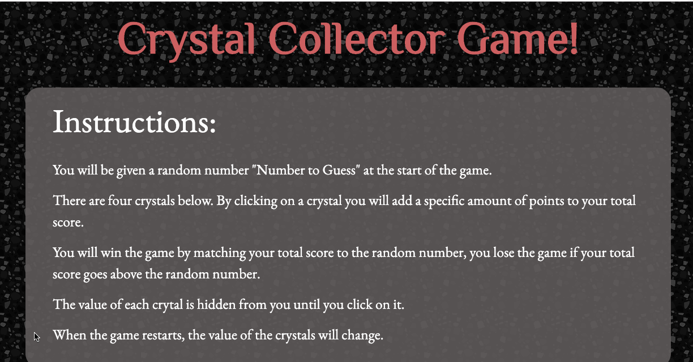

# Crystal Collector Game!

## Live link

https://shelbyreins.github.io/unit-4-game/

## Description on how to use

- You will be given a random number "Number to guess" at the start of the game. 
- There are four crystals below. By clicking on a crystal you will add a specific amount of point to your total score.
- You will win the game by matching your total score to the random number, you lose the game if your total score goes  above the random number. 
- The value of each crytal is hidden from you until you click on it.
- When the game restarts, the value of the crystals will change.

### Game Design Notes

- The random number shown should be between 19-120
- Each crystal should have random hidden value number between 1 - 12

 ### Technologies Used
 - HTML
 - CSS
 - Bootstrap
 - Git
 - Github
 - JavaScript
 - jQuery

 ### Acknowledgements 

 Credit for crystal images: https://transparentgems.tumblr.com/

